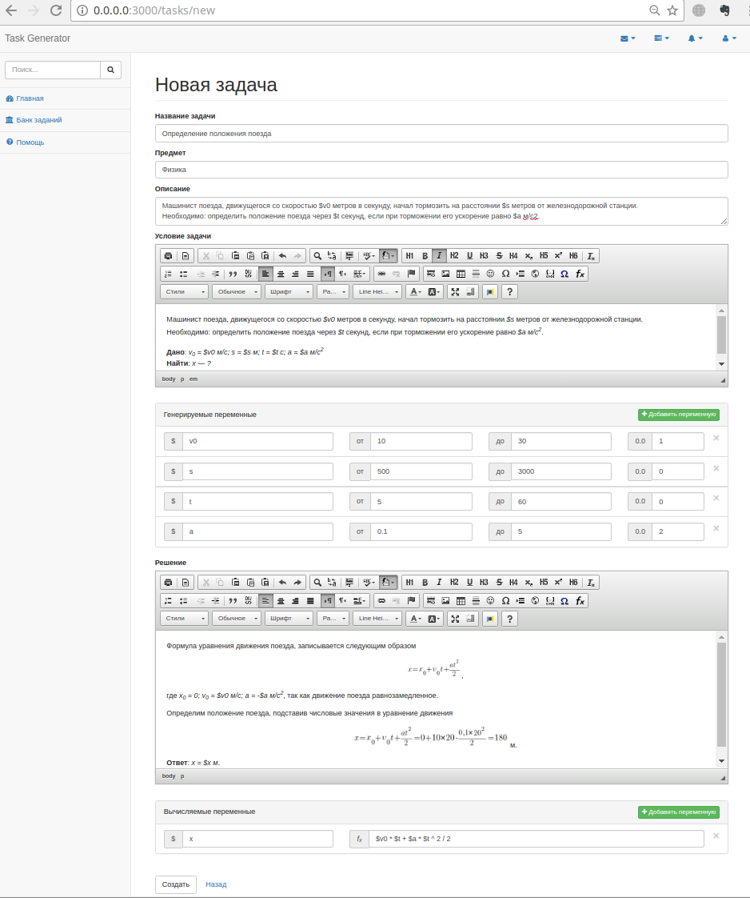

**Аннотация**
=============

Расчетно-пояснительная записка разработана к веб-приложению «Генератор
заданий» на основе учебного плана кафедры ИУ6.

В расчетно-пояснительной записке представлены обоснования основных
проектных решений, принятых на каждом этапе разработки веб-приложения
«Генератор заданий», используемого для формирования заданий с
индивидуальными вариантами, собранными из отдельных задач, и
предназначенного для преподавателей и учителей российских ВУЗов и школ.

**Реферат**
===========
ГЕНЕРАЦИЯ ВАРИАНТОВ, ТЕКСТОВЫЙ РЕДАКТОР, ШАБЛОН ЗАДАЧИ, ШАБЛОН БИЛЕТА,
ГЕНЕРАЦИЯ ПЕРЕМЕННЫХ, ВЫЧИСЛЕНИЕ ПО ФОРМУЛЕ, МНОГОВАРИАНТНЫЕ ЗАДАНИЯ.

Объектом разработки является веб-приложение «Генератор заданий».

Цель работы -- проектирование веб-приложения «Генератор заданий»,
позволяющий:

- ввод шаблона задачи и решения;
- объединение задач в группы задач;
- ввод шаблона билета;
- генерирование вариантов по шаблону билета;
- сохранение раннее сгенерированных вариантов;
- просмотр раннее сгенерированных вариантов;
- поиск задач, групп задач, билетов;

В результате разработки было спроектировано и реализовано веб-приложение
«Генератор заданий».

Пользователями системы могут быть учителя, преподаватели, школьники и
студенты российских школ и ВУЗов

**Содержание**
==============

[Введение](#Введение)

[1 Анализ требований и уточнение спецификаций](#1-Анализ-требований-и-уточнение-спецификаций)

[1.1 Анализ задания и выбор технологии, языка и среды разработки](#11-Анализ-задания-и-выбор-технологии-языка-и-среды-разработки)

[1.2 Разработка диаграммы вариантов использования](#12-Разработка-диаграммы-вариантов-использования)

[1.3 Разработка концептуальной диаграммы классов](#13-Разработка-концептуальной-диаграммы-классов)

[1.4 Анализ способа хранения информации и выбор системы хранения](#14-анализ-способа-хранения-информации-и-выбор-системы-хранения)

[2 Проектирование структуры и компонентов программного продукта](#2-Проектирование-структуры-и-компонентов-программного-продукта)

[2.1 Разработка интерфейса пользователя](#21-Разработка-интерфейса-пользователя)

[2.1.1 Построение графа (диаграммы) состояний интерфейса](#211-построение-графа-диаграммы-состояний-интерфейса)

[2.1.2 Разработка форм ввода-вывода информации](#212-Разработка-форм-ввода-вывода-информации)

[2.1.2.1 Главная страница](#2121-Главная-страница)

[2.1.2.2 Страница регистрации](#2122-Страница-регистрации)

[2.1.2.3 Страница входа](#2123-Страница-входа)

[2.1.2.4 Страница помощи](#2124-Страница-помощи)

[2.1.2.5 Страница поиска](#2125-Страница-поиска)

[2.1.2.6 Страница добавления / редактирования задачи](#2126-Страница-добавления-редактирования-задачи)

[2.1.2.7 Элемент из списка задач](#2127-Элемент-из-списка-задач)

[2.1.2.8 Страница просмотра задачи](#2128-Страница-просмотра-задачи)

[2.1.2.9 Страница добавления / редактирования группы задач](#2129-Страница-добавления-редактирования-группы-задач)

[2.1.2.10 Элемент из списка группы задач](#21210-Элемент-из-списка-группы-задач)

[2.1.2.11 Страница группы задач](#21211-Страница-группы-задач)

[2.1.2.12 Страница добавления / редактирования билета](#21212-Страница-добавления-редактирования-билета)

[2.1.2.13 Элемент из списка билетов](#21213-Элемент-из-списка-билетов)

[2.1.2.14 Страница просмотра всех билетов (задач, групп задач) пользователя](#21214-Страница-просмотра-всех-билетов-задач-групп-задач-пользователя)

[2.1.2.15 Страница билета](#21215-Страница-билета)

[2.1.2.16 Страница просмотра сгенерированных вариантов](#21216-Страница-просмотра-сгенерированных-вариантов)

[2.2 Разработка структурной схемы программного продукта](#22-Разработка-структурной-схемы-программного-продукта)

[2.3 Разработка схем алгоритмов модулей](#23-Разработка-схем-алгоритмов-модулей)

[2.4 Разработка диаграммы размещения](#24-Разработка-диаграммы-размещения)

[3. Выбор стратегии тестирования и разработка тестов](#3-Выбор-стратегии-тестирования-и-разработка-тестов)

[3.1 Стратегии тестирования](#31-Стратегии-тестирования)

[3.2 Черный ящик](#32-Черный-ящик)

[3.3 Оценочное тестирование](#33-Оценочное-тестирование)

[Заключение](#Заключение)

Приложение А. Техническое задание.

Приложение Б. Руководство пользователя.

**Введение**
============

Преподаватели в школах и вузах выдают своим ученикам задания. Они
позволяют ученикам разобраться в изучаемой теме, а преподаватели с их
помощью оценивают успехи учеников. Особый вид заданий --- это
многовариантные задания, они имеют несколько вариантов условий, которые
отличаются исходными данными или деталями постановки вопроса. Чаще всего
многовариантные задания используются во время контрольных работ и других
мероприятий, тестирующих знания, каждый учащийся получает свой вариант
условия. Это затрудняют совместное решение заданий участниками, в более
простой формулировке --- это затрудняет «списывание». Многовариантные
задания являются одним из наиболее эффективных способов защиты от
списывания. В некоторых ситуациях при использовании таких заданий
преподаватели могут позволить себе проводить тестирование даже без
контроля процесса решения, т.е. удаленно или выдавая задания на дом.

Многовариантные задания имеют и другие сферы применения кроме защиты от
списывания. При переписывании контрольной учащемуся требуется выдавать
новые условия заданий, похожие, но отличающиеся от тех, которые он
выполнял ранее. Т.е. многовариантные задания позволят сделать
тестирования повторяемыми, тем самым они решают сразу несколько проблем,
связанных с проведениями тестирований.

Еще одно применение, не менее важное чем предыдущие, это тренировка в
решении и закрепление навыков за счет решения большого количества
заданий на определённую тему.

Цель закрепления навыков принципиально отличается от цели защиты от
списывания, потому что ставит более жесткие требования на различия между
заданиями одного типа. Если для защиты достаточно небольшого изменения
условия, которое не касается содержательной основы задачи, то для
тренировки задачи должны быть максимально разнообразны в рамках того
сюжета, который они покрывают. Другими словами, при проведении
тестирования сложность всех вариантов одного задания должна быть
одинаковой. При тренировке навыка каждое новое задание должно
затрагивать новые для студента ситуации, с которыми он еще не
встречался.

Ручная подготовка многовариантных заданий представляет сложность в
первую очередь из-за объема необходимой однообразной работы и
возникающих при этом ошибок и опечаток.

Веб-приложение «Генератор заданий» позволяет генерировать
многовариантные учебные задания. Многовариантные задания имеют несколько
вариантов условия и могут использоваться преподавателями во время
контрольных работ. Учащиеся могут использовать многовариантные задания
для тренировки в решении задач по определенной теме.

Существуют аналогичные генераторы, расположенные в сети Интернет и
позволяющие учителям и преподавателям генерировать задания, не выходя из
браузера.

Например, существует сайт
[http://abak.pozitiv-r.ru/math/191-generatorzadanij-onlajn](http://abak.pozitiv-r.ru/math/191-generatorzadanij-onlajn) - он генерирует задания на арифметические вычисления. Учитель или
преподаватель может установить ряд параметров генерации: выбрать
разрядность чисел, какие именно арифметические операции использовать,
сколько должно быть операций, генерировать ли скобки. Этот сайт сам по
себе вряд ли будет полезен широкому кругу преподавателей, потому что
других генераторов на нем нет, но он лишний раз демонстрирует
актуальность данной разработки.

Более серьезные разработки можно найти в англоязычном Интернете. Вот
несколько сайтов, позволяющих генерировать задания не выходя из
браузера:
[[http://www.math-aids.com]{.underline}](http://www.math-aids.com),
[[http://mytestbook.com]{.underline}](http://mytestbook.com),
[[http://www.makeworksheets.com/platinum/samples/math/index.html]{.underline}](http://www.makeworksheets.com/platinum/samples/math/index.html).
Последний сайт, в отличие от первых двух, платный. Наборы заданий на
всех сайтах ограничены, т.е., если необходимого задания нет,
сгенерировать его не получится. Еще один недостаток --- это английский
язык условий, хотя среди задач встречается много задач без текста. Ну а
очевидное достоинство сайтов --- красочный результат. В заданиях
используются рисунки, и все это аккуратно расположено на листе.

1 Анализ требований и уточнение спецификаций
================================================

1.1 Анализ задания и выбор технологии, языка и среды разработки
---------------------------------------------------------------

Как показал анализ задания, в программном продукте должно быть
реализовано:

-   регистрация новых пользователей;
-   авторизация пользователей;
-   ввод шаблона задачи и решения;
-   объединение задач в группы задач;
-   ввод шаблона билета, включающего в себя задачи или группы задач;
-   генерирование вариантов по шаблону билета;
-   сохранение раннее сгенерированных вариантов;
-   просмотр ранее сгенерированных вариантов;
-   редактирование и удаление задач, групп задач, билетов;
-   поиск задач, групп задач, билетов;

Для создания данного программного продукта был использован полноценный,
многоуровневый фреймворк, использующий базы данных, Ruby on Rails,
который основан на архитектуре Модель-Представление-Контроллер
(Model-View-Controller, MVC). Обработка запросов и выдача данных
в контроллерах, предметная область, отраженная в базе данных, --- для
всего этого Rails предоставляет однородную среду разработки на Ruby.
Основным преимуществом языка программирования Ruby и фреймворка Ruby on
Rails считается скорость разработки. Практика показывает, что скорость
разработки проектов на RoR увеличивается на 30 --- 40 процентов по
отношению к любому другому языку программирования или фреймворку. В
первую очередь прирост скорости разработки определяется обширным набором
готовых к работе штатных инструментов RoR, колоссальным набором готовых
решений в сообществе, языком Ruby и простоте программирования на нем.
Кроме того, в отличие от других фреймворков, в составе RoR есть отличные
средства автоматизированного тестирования, что ускоряет переход проекта
от стадии «программа написана» к стадии «программа работает без ошибок».
Так же следует отметить, что Ruby on Rails обеспечивает лучшую
безопасность проекта. При использовании инструментов RoR исключены
SQL-инъекции и XSS-атаки, все входные параметры экранируется по
умолчанию, выводимые переменные в шаблонах также экранируются.

1.2. Разработка диаграммы вариантов использования
-------------------------------------------------

Для уточнения требований к функционированию программного продукта
определим варианты использования. Программный продукт взаимодействует с
двумя действующими лицами --- неавторизованный пользователь (далее
гость), авторизованный пользователь.

Гость имеет возможность просматривать имеющиеся задачи, группы задач и
билеты. После авторизации пользователь может добавлять, изменять и
удалять задачи, группы задач, билеты и генерировать многовариантные
задания по шаблону билета.

Таким образом, можно получить диаграммы вариантов использования,
представленные на рисунках 1, 2, 3.

**Рисунок 1 -** Диаграмма вариантов использования при просмотре
материалов на сайте

**Рисунок 2 -** Диаграмма вариантов использования при работе с задачами
и группами задач

**Рисунок 3 -** Диаграмма вариантов использования при работе с билетами

1.3. Разработка концептуальной диаграммы классов
------------------------------------------------

Концептуальные диаграммы классов демонстрируют связи между основными
понятиями предметной области. В проектируемом программном продукте
основным понятиям в модели ставятся в соответствие классы. Составленная
диаграмма представлена на рисунке 4.

**Рисунок 4 --** Концептуальная диаграмма классов предметной области

1.4. Анализ способа хранения информации и выбор системы хранения
----------------------------------------------------------------

Существует несколько технологий позволяющих хранить и упорядочивать
информацию. В случае данного программного продукта необходимо хранить
сам исходный код. Для данного способа хранения существует множество
систем управления базой данных (СУБД). Проанализировав их, я пришёл к
выводу, что наиболее хорошим вариантом будет использование PostgreSQL,
т.к. оно обладает следующими преимуществами: поддержка БД
неограниченного размера, мощные и надёжные механизмы транзакций и
репликации, расширяемая система встроенных языков программирования,
наследование, легкая расширяемость.

Прежде, чем приступать к созданию системы автоматизированной обработки
информации, необходимо сформировать понятия о предметах, фактах и
событиях, которыми будет оперировать данная система. Для того, чтобы
привести эти понятия к той или иной модели данных, необходимо заменить
их информационными представлениями. Одним из наиболее удобных
инструментов унифицированного представления данных, независимого от
реализующего его программного обеспечения, является модель
\"сущность-связь\".

Модель \"сущность-связь\" основывается на некой важной семантической
информации о реальном мире и предназначена для логического представления
данных. Она определяет значения данных в контексте их взаимосвязи с
другими данными.

На рисунке 5 приведена инфологическая модель «сущность-связь» по нотации
Чена. После была разработана схема данных для данного программного
продукта представленная на рисунке 6.

**Рисунок 5** -- Инфологическая модель сущность - связь по нотации Чена

**Рисунок 6 --** Схема данных

**2 Проектирование структуры и компонентов программного продукта**
==================================================================

2.1 Разработка интерфейса пользователя
--------------------------------------

### 2.1.1 Построение графа (диаграммы) состояний интерфейса

Проектирование программного продукта начнем с разработки графа состояний
интерфейса, который будет основан на результатах, полученных, на этапе
анализа. С помощью графа состояний интерфейса уточняем операции, которые
будут выполняться в каждом режиме работы программного продукта. Данный
граф представлен на рисунке 7.

**Рисунок 7** -- Граф состояний интерфейса

1 -- Нажатие на ссылку «Авторизация».

2 -- Нажатие на ссылку «Зарегистрироваться».

3 -- Нажатие на ссылку «Войти».

4 -- Успешная авторизация пользователя.

5 -- Нажатие на кнопку «Добавить» панели «Обзор задач».

6 -- Нажатие на ссылку «Банк заданий».

7 -- Нажатие на кнопку «Добавить» панели «Обзор групп задач».

8 -- Нажатие на кнопку «Добавить» панели «Обзор билетов».

9 -- Нажатие на кнопку «Посмотреть все» панели «История генераций».

10 -- Успешное добавление задачи в БД.

11 -- Нажатие на кнопку «Редактировать».

12 -- Успешное обновление задачи в БД.

13 -- Нажатие на кнопку «Добавить в группу задач».

14 -- Закрытие модального окна.

15 -- Нажатие на элемент списка задач.

16, 17, 20 -- Поиск среди задач

18, 19, 40 -- Поиск среди билетов

21, 22, 23 -- Поиск среди групп задач

24 -- Нажатие на элемент списка группы задач.

25 -- Успешное добавление группы задач в БД.

26 -- Успешное добавление билета в БД.

27 -- Нажатие на элемент списка историй генераций.

28 -- Нажатие на кнопку «Сгенерировать».

29 -- Закрытие модального окна.

30 -- Успешная генерация билетов.

31 -- Нажатие на кнопку «Редактировать».

32 -- Успешное обновление билета в БД.

33 -- Нажатие на кнопку «Редактировать».

34 -- Успешное обновление группы задач в БД.

35 -- Нажатие на кнопку «Сгенерировать PDF» вкладки «Билеты».

36 -- Нажатие на кнопку «Сгенерировать PDF» вкладки «Ответы».

37 -- Нажатие на элемент списка билетов.

38 -- Нажатие на кнопку выпадающего меню «Выйти», происходит выход из
учетной записи.

39 -- Нажатие на ссылку «Главная»

41 -- Закрытие страницы/окна браузера.

42, 43 -- Закрытие вкладки браузера

### 2.1.2 Разработка форм ввода-вывода информации

#### 2.1.2.1 Главная страница

Для улучшение эргономики восприятия главная страница Сайта
спроектирована с визуально разделенными тремя областями:

{width="6.510416666666667in"
height="5.041666666666667in"}

Рисунок 8 -- Главная страница

1.  В верхней области экрана расположен **заголовок**, в котором
    отображаются следующие объекты:

-   Ссылка с названием сайта. Ссылка перехода на главную страницу,
    > доступная на всех страницах сайта.

-   Выпадающее меню с ссылками для входа и регистрации для гостя и для
    > выхода с сайта для авторизованного пользователя

2.  Слева под заголовком расположены два объекта (сверху вниз) *Поиск* и
    *Меню*.

-   Поле *Поиск*, используемое для поиска информации на сайте

-   *Меню* представляет собой упорядоченный список ссылок,
    > предназначенное для навигации по Сайту:

    *Главная* --- ссылка на главную страницу сайта

    *Банк заданий* --- ссылка на страницу поиска задач, групп задач,
    билетов

    *Помощь* --- ссылка на страницу, где отображается руководство
    пользователя

3.  **Центральная часть** экрана содержит основное содержание страницы,
    на главной странице находится четыре панели:

-   «Обзор билетов», отображающая список из пяти последних измененных
    > билетов. Содержит:

    -   кнопка «Добавить» для перехода на страницу добавления нового
        > билета;

    -   кнопка «Посмотреть все» для перехода на страницу отображающую
        > список всех билетов, принадлежащих пользователю;

    -   cписок из пяти последних измененных билетов.

-   «Обзор задач», отображающая список из пяти последних измененных
    > задач. Содержит:

    -   кнопка «Добавить» для перехода на страницу добавления новой
        > задачи

    -   кнопка «Посмотреть все» для перехода на страницу отображающую
        > список всех задач, принадлежащих пользователю

    -   cписок из пяти последних измененных билетов.

-   «История генераций билетов», пять последних генераций билетов.
    > Содержит:

    -   кнопка «Посмотреть все» для перехода на страницу отображающую
        > всю историю генерации пользователя

    -   cписок из пяти последних измененных билетов.

-   «Обзор групп задач», отображающая список из пяти последних
    > измененных групп задач. Содержит:

    -   кнопка «Добавить» для перехода на страницу добавления новой
        > задачи

    -   кнопка «Посмотреть все» для перехода на страницу отображающую
        > список всех задач, принадлежащих пользователю

    -   cписок из пяти последних измененных билетов.

### 2.1.2.2 Страница регистрации

Содержит форму регистрации пользователя (рис. 11), имеющая поля ввода
email и пароля и кнопку «Регистрация». Для ввода пароля используется
специальное поле ввода (\<input type="password"\>, скрывающее вводимые
символы звездочками или точками (в зависимости от браузера).

{width="3.8125in" height="2.53125in"}

Рисунок 9 -- Страница регистрации

### 2.1.2.3 Страница входа

Содержит форму входа на сайт (рис. 11), имеющая поля ввода email и
пароля и кнопку «Войти». Для ввода пароля используется специальное поле
ввода (\<input type="password"\>, скрывающее вводимые символы
звездочками или точками (в зависимости от браузера).

{width="4.753086176727909in"
height="2.9166666666666665in"}

Рисунок 10 -- Страница входа

### 2.1.2.4 Страница помощи

Отображает руководство пользователя

{width="3.6360323709536306in" height="1.34375in"}

Рисунок 21 -- Страница помощи

### 2.1.2.5 Страница поиска

Содержит список задач, групп задач, билетов наиболее подходящих по
запросу поиска, также содержит форму поиска с полем для ввода запроса и
кнопками для выбора раздела поиска: «Задачи», «Билеты» и «Группы задач»

{width="5.364583333333333in"
height="2.0064720034995625in"}

Рисунок 32 - Страница поиска

### 2.1.2.6 Страница добавления / редактирования задачи

Содержит форму для добавлении / редактирования задачи

{width="4.590239501312336in"
height="5.489583333333333in"}

Рисунок 43 -- Страница добавления / редактирования задачи

Форма имеет следующие обязательные поля:

-   Название задачи

-   Условие задачи --- шаблон условия задачи

и необязательные поля:

-   Предмет

-   Описание --- отображается в списках задача

-   Решение задачи --- шаблон решения задачи

На странице имеются вложенные формы - «Переменные» (рис. 14). При
генерации задачи в шаблоне условие задачи, решение задачи и в формуле
вычисляемых переменных вместо подстрок \$\<имя переменной\> будет
подставляться случайно сгенерированная переменная в диапазоне от верхней
границы до нижней границы, округленная до указанного значения. Для
добавления дополнительных форм для переменных имеется кнопка «Добавить
переменную». Для удаления переменной нужно нажать на крестик нужной
формы.

{width="6.572916666666667in" height="0.9375in"}

Рисунок 54 -- Панель «Генерируемых переменных»

На странице имеются вложенные формы - «Вычисляемые переменные» (рис.
15). При генерации задачи в шаблоне условие задачи, решение задачи и в
формуле вычисляемых переменных вместо подстрок \$\<имя переменной\>
будет подставляться вычисленная переменная по формуле. Для добавления
дополнительных форм для вычисляемых переменных имеется кнопка «Добавить
переменную». Для удаления переменной нужно нажать на крестик нужной
формы.

{width="6.635416666666667in"
height="1.1041666666666667in"}

Рисунок 65 -- Панель «Вычисляемых переменных»

### 2.1.2.7 Элемент из списка задач

{width="5.614583333333333in"
height="1.068581583552056in"}

Рисунок 76 -- Элемент из списка задач

Содержит:

-   название задачи

-   описание задачи

-   email пользователя добавивший задачу

-   дата изменения задачи

-   ссылка, покрывающая весь элемент списка и отправляющая на страницу
    задачи

-   кнопка «редактировать»

-   кнопка «удалить»

-   кнопка «Добавить в группу»

-   кнопка «Добавить к себе»

### 2.1.2.8 Страница просмотра задачи

Содержит всю информацию о задаче и кнопки: «Редактировать», «Удалить»,
«Добавить в группу», «Добавить к себе»

{width="4.451975065616798in"
height="2.7708333333333335in"}

Рисунок 87 - Страница просмотра задачи

### 2.1.2.9 Страница добавления / редактирования группы задач

Содержит форму для добавлении / редактирования группы задач

{width="3.8224890638670166in" height="2.03125in"}

Рисунок 98 -- Страница добавления / редактирования группы задач

Форма имеет следующие обязательные поля:

-   Название задачи

и необязательные поля:

-   Предмет

-   Описание --- отображается в списках задача

### 2.1.2.10 Элемент из списка группы задач

{width="5.916666666666667in"
height="1.348924978127734in"}

Рисунок 19 -- Элемент из списка группы задач

Содержит:

-   название группы задач

-   описание группы задач

-   email пользователя добавивший группу задач

-   дата изменения группы задач

-   ссылка, покрывающая весь элемент списка и отправляющая на страницу
    > группы задач

-   кнопка «редактировать»

-   кнопка «удалить»

-   кнопка «Добавить к себе»

### 2.1.2.11 Страница группы задач

Содержит всю информацию о группе задач, список входящих в неё задач с
кнопкой для удаления из списка и кнопки: «Редактировать», «Удалить»,
«Добавить к себе»

{width="5.299441163604549in"
height="2.7291666666666665in"}

**Рисунок 20** - Страница группы задач

### 2.1.2.12 Страница добавления / редактирования билета

Содержит форму для добавлении / редактирования билета

{width="5.213803587051618in"
height="5.385416666666667in"}

**Рисунок 21** - Страница добавления / редактирования билета

Форма имеет следующие обязательные поля:

-   Название билета

-   Текст билета --- шаблон, по которому генерируется билет

и необязательные поля:

-   Предмет

-   Описание --- отображается в списках задача

### 2.1.2.13 Элемент из списка билетов

{width="6.40625in" height="1.2291666666666667in"}

**Рисунок 22** - Элемент из списка билетов

Содержит:

-   название билета;

-   описание билета;

-   email пользователя добавивший билет;

-   дата изменения билета;

-   ссылка, покрывающая весь элемент списка и отправляющая на страницу
    > билета;

-   кнопка «редактировать»;

-   кнопка «удалить»;

-   кнопка «Сгенерировать»;

-   кнопка «Добавить к себе»;

### 2.1.2.14 Страница просмотра всех билетов (задач, групп задач) пользователя

Содержит список билетов (задач, групп задач) добавленных пользователем и
кнопку добавления нового билета (задачи, группы задач).

{width="4.208333333333333in"
height="1.9315857392825897in"}

**Рисунок 23** - Страница просмотра всех билетов пользователя

### 2.1.2.15 Страница билета

Содержит всю информацию о билете и кнопки: «Редактировать», «Удалить»,
«Сгенерировать», «Добавить к себе».

{width="3.699748468941382in"
height="2.6458333333333335in"}

**Рисунок 24 -** Страница билета

### 2.1.2.16 Страница просмотра сгенерированных вариантов

Содержит всю информацию о генерации, панель для пред просмотра
сгенерированных вариантов и ответов и формы для генерации PDF файла со
сгенерированными вариантами и ответами.

{width="6.666666666666667in"
height="6.479166666666667in"}

**Рисунок 25** - Страница просмотра сгенерированных вариантов

2.2. Разработка структурной схемы программного продукта
-------------------------------------------------------

Произведем объектную декомпозицию предметной области и создадим
структурную схему, отражающую состав и взаимодействие объектов
программного продукта. Структурная схема программного продукта приведена
на рисунке 26.

**Рисунок 26 --** Структурная схема программного продукта

2.3 Разработка схем алгоритмов модулей
--------------------------------------

Схемы алгоритмов позволяют представить в графическом виде взаимосвязи
между структурами программы. Ниже приведены схемы алгоритмов модулей,
которые составляют разрабатываемый программный продукт (модули,
разработанные в рамках в данной курсовой работы). Это дает представление
о необходимых для их функционирования данных.

Алгоритм функции генерации многовариантных задач для билета и функции
генерации ответов приведены на рисунках 27, 28 соответственно.

На рисунке 29 приведены:

\- алгоритм функции «calculate», которая отправляет запрос на вычисление
выражения на внешний сервис «WolframAlfa» и получает ответ от него. Для
большей производительности, в функции реализовано кэширование ответов.

\- алгоритм функции «paste\_variables», которая вставляет
сгенерированные переменные в текст. В функции выполняется сортировка
сгенерированных переменных по имени для реализации "жадности"
переменных, т.е. чтобы переменные с длинными именами не затирались
переменными с более короткими именами.

**Рисунок 27** -- Алгоритм функции генерации многовариантных задач для
билета

**Рисунок 28** -- Алгоритм функции генерации ответов

**Рисунок 29** -- Алгоритмы функций вычисления по формуле

и функции вставки сгенерированных переменных в текст

2.4 Разработка диаграммы размещения
-----------------------------------

При физическом проектировании распределенных систем необходимо
определить, каким образом будут размещены программные компоненты на
реальном оборудовании в локальной или глобальной сетях. Чтобы физическое
представление программной системы было полным, надо было предоставить
информацию о том, как осуществляется физическая взаимосвязь между
программными и аппаратными компонентами системы. Разработанное
веб-приложение использует двухзвенную клиент-серверную архитектуру
(Рисунок 30).

{width="4.484375546806649in"
height="2.1354166666666665in"}

**Рисунок 30** - Двухзвенная архитектура «клиент-сервер»

Для того, чтобы подробнее описать разработанное веб-приложение,
составлена диаграмма размещений, отражающая физическую структуру и
взаимосвязи между компонентами созданной системы. На диаграмме показаны:
существующие аппаратные компоненты («узлы»), программные компоненты,
работающие на каждом из них; и то, как различные части этой системы
соединены друг с другом.

На рисунке 31 можно видеть диаграмму размещения компонентов
разработанного программного продукта, при развертывании его на сервере.

**Рисунок 31** - Диаграмма размещения на сервере

**3. Выбор стратегии тестирования и разработка тестов**
=======================================================

3.1 Стратегии тестирования
--------------------------

Существует множество способов тестирования программного продукта. Метод
черного ящика позволяет оценить правильность ввода и обработки
поступающей информации. Белый ящик наоборот позволяет оценивать
эффективность и искать ошибки путем ручного просмотра кодов программы.
Минусами данных методов является невозможность предусмотреть все
варианты ошибок и необходимость большой дополнительной работы. К плюсам
стоит отнести возможность поиска ошибок и тестирования программ на
реальных примерах, что увеличивает шанс найти ошибку.

В составе Ruby on Rails есть отличные средства автоматизированного
тестирования. Rails предлагает писать тесты очень просто -- при создании
модели и контроллера, он начинает создавать скелет тестового кода.
Простой запуск тестов Rails позволяет убедиться, что код придерживается
нужной функциональности даже после большой переделки кода. Тесты Rails
также могут симулировать запросы браузера, таким образом, можно
тестировать отклик своего приложения без необходимости тестирования с
использованием браузера.

В Rails тестирование различных экшнов контроллера --- это форма
написания функциональных тестов. При написании функциональных тестов,
тестируется, как экшны обрабатывают запросы, ожидаемый результат и
отклики вьюх HTML.

После проверки на наличие ошибок приступают к оценочному тестированию -
проверка на соответствие нормам и стандартам. Данный метод тестирования
позволяет оценить окончательную готовность программного продукта.
Оценивается программный продукт по многим параметрам:

> • тестирование удобства использования - последовательная проверка
> соответствия программного продукта и документации на него основным
> положениям технического задания;
>
> • тестирование удобства эксплуатации - анализ психологических
> факторов, возникающих при работе с программным обеспечением; это
> тестирование позволяет определить, удобен ли интерфейс, не раздражает
> ли цветовое или звуковое сопровождение и т. п.;
>
> • тестирование защиты - проверка защиты, например, от
> несанкционированного доступа к информации;
>
> • тестирование конфигурации оборудования *- *проверка
> работоспособности программного обеспечения на разном оборудовании;
>
> • тестирование совместимости - проверка преемственности версий: в тех
> случаях, если очередная версия системы меняет форматы данных, она
> должна предусматривать специальные конвекторы, обеспечивающие
> возможность работы с файлами, созданными предыдущей версией системы;
>
> • тестирование документации - тщательная проверка документации,
> например, если документация содержит примеры, то их все необходимо
> попробовать;

Для тестирования данной системы был выбраны метод черного ящика и методы
оценочного тестирования. В методе черного ящика на вход к различным
модулям подаются различные данные (как правильные, так и нет). Оценочные
методы тестирования позволяют оценить соответствие программного продукта
требованиям.

Черный ящик
-----------

В таблице 1 приведены результаты ручного тестирования проверки входных
данных при регистрации.

Таблица 1 -- Проверка входных данных при регистрации

+-------------+-------------+-------------+-------------+-------------+
| Номер теста | Назначение  | Введенные   | Реакция     | Вывод       |
|             | теста       |             | программы   |             |
|             |             | данные      |             |             |
+=============+=============+=============+=============+=============+
| 1           | Проверка    | Email:1234  | Ошибка, не  | Программа   |
|             | ввода не    |             | корректно   | сработала   |
|             | валидного   | Password:12 | введен      | корректно.  |
|             | email       | 3456        | email.      | Email       |
|             |             |             |             | должен      |
|             |             | Password\_c |             | содержать   |
|             |             | onf:        |             | символ @.   |
|             |             | 123456      |             |             |
|             |             |             |             |             |
|             |             | (пользовате |             |             |
|             |             | ль          |             |             |
|             |             | не          |             |             |
|             |             | зарегистрир |             |             |
|             |             | ован)       |             |             |
+-------------+-------------+-------------+-------------+-------------+
| 2           | Проверка    | Email:qwe\@ | Регистрация | Программа   |
|             | ввода       | mail.ru     | прошла      | сработала   |
|             | корректных  |             | успешно.    | корректно.  |
|             | данных      | Password:   |             |             |
|             |             | 123456      |             |             |
|             |             |             |             |             |
|             |             | Password\_c |             |             |
|             |             | onf:        |             |             |
|             |             | 123456      |             |             |
|             |             |             |             |             |
|             |             | (пользовате |             |             |
|             |             | ль          |             |             |
|             |             | не          |             |             |
|             |             | зарегистрир |             |             |
|             |             | ован)       |             |             |
+-------------+-------------+-------------+-------------+-------------+
| 3           | Проверка    | Email:qwe\@ | Ошибка,     | Программа   |
|             | ввода email | mail.ru     | такой       | сработала   |
|             | для уже     |             | пользовател | корректно.  |
|             | зарегистрир | Password:   | ь           |             |
|             | о-вавшегося | 123456      | уже есть в  |             |
|             | пользовател |             | системе.    |             |
|             | я           | Password\_c |             |             |
|             |             | onf:        |             |             |
|             |             | 123456      |             |             |
|             |             |             |             |             |
|             |             | (пользовате |             |             |
|             |             | ль          |             |             |
|             |             | зарегистрир |             |             |
|             |             | ован)       |             |             |
+-------------+-------------+-------------+-------------+-------------+
| 4           | Проверка не | Email:qwe1\ | Ошибка, не  | Программа   |
|             | корректного | @mail.ru    | корректно   | сработала   |
|             | ввода       |             | введен      | корректно.  |
|             | повтора     | Password:   | повтор      |             |
|             | пароля      | 12345678    | пароля.     |             |
|             |             |             |             |             |
|             |             | Password\_c |             |             |
|             |             | onf:        |             |             |
|             |             | 123456      |             |             |
|             |             |             |             |             |
|             |             | (пользовате |             |             |
|             |             | ль          |             |             |
|             |             | не          |             |             |
|             |             | зарегистрир |             |             |
|             |             | ован)       |             |             |
+-------------+-------------+-------------+-------------+-------------+

В таблице 2 приведены результаты ручного тестирования проверки входных
данных при авторизации.

Таблица 2 -- Проверка входных данных при авторизации

+-------------+-------------+-------------+-------------+-------------+
| Номер теста | Назначение  | Введенные   | Реакция     | Вывод       |
|             | теста       |             | программы   |             |
|             |             | данные      |             |             |
+=============+=============+=============+=============+=============+
| 1           | Проверка не | Email:      | Ошибка,     | Программа   |
|             | корректного | qweq\@mail. | Email или   | сработала   |
|             | ввода email | ru          | пароль      | корректно.  |
|             |             |             | введены не  |             |
|             |             | Password:   | верно.      |             |
|             |             | 123456      |             |             |
|             |             |             |             |             |
|             |             | (пользовате |             |             |
|             |             | ль          |             |             |
|             |             | не          |             |             |
|             |             | зарегистрир |             |             |
|             |             | ован)       |             |             |
+-------------+-------------+-------------+-------------+-------------+
| 2           | Проверка    | Email:qwe\@ | Вход в      | Программа   |
|             | ввода       | mail.ru     | аккаунт     | сработала   |
|             | корректных  |             | выполнен    | корректно.  |
|             | данных      | Password:   | успешно.    |             |
|             |             | 123456      |             |             |
|             |             |             |             |             |
|             |             | (пользовате |             |             |
|             |             | ль          |             |             |
|             |             | зарегистрир |             |             |
|             |             | ован)       |             |             |
+-------------+-------------+-------------+-------------+-------------+
| 3           | Проверка не | Email:qwe\@ | Ошибка,     | Программа   |
|             | корректного | mail.ru     | Email или   | сработала   |
|             | ввода       |             | пароль      | корректно.  |
|             | пароля      | Password:   | введены не  |             |
|             |             | 123456z     | верно.      |             |
|             |             |             |             |             |
|             |             | (пользовате |             |             |
|             |             | ль          |             |             |
|             |             | зарегистрир |             |             |
|             |             | ован)       |             |             |
+-------------+-------------+-------------+-------------+-------------+

Были написаны функциональные тесты, в которых тестируются, как экшны
обрабатывают запросы, ожидаемый результат и отклики вьюх HTML. Далее в
таблицах приведены результаты автоматизированного тестирования
контроллеров веб-приложения.

Таблица 3 -- Тестирование контроллера «Generation»

  Номер теста   Назначение теста                                               Результат
  ------------- -------------------------------------------------------------- -----------
  1             Проверка отображение истории генераций                         Пройден
  2             Проверка отображение условий сгенерированных вариантов         Пройден
  3             Проверка отображение ответов сгенерированных вариантов         Пройден
  4             Проверка генерирования вариантов                               Пройден
  5             Проверка отображения страницы со сгенерированными вариантами   Пройден
  6             Проверка удаления сгенерированных вариантов                    Пройден

Таблица 4 -- Тестирование контроллера «MainPage»

  Номер теста   Назначение теста                                            Результат
  ------------- ----------------------------------------------------------- -----------
  1             Проверка отображения главной страницы                       Пройден
  2             Проверка отображения страницы с руководством пользователя   Пройден

Таблица 5 -- Тестирование контроллера «QuestionCard»

  Номер теста   Назначение теста                                          Результат
  ------------- --------------------------------------------------------- -----------
  1             Проверка отображения страницы поиска                      Пройден
  2             Проверка отображения страницы всех билетов пользователя   Пройден
  3             Проверка отображения страницы «Добавления билета»         Пройден
  4             Проверка создания билета                                  Пройден
  5             Проверка создания копии билета для пользователя           Пройден
  6             Проверка отображения страницы билета                      Пройден
  7             Проверка отображения страницы «Редактирование билета»     Пройден
  8             Проверка удаления билета                                  Пройден

Таблица 6 -- Тестирование контроллера «Task»

  Номер теста   Назначение теста                                        Результат
  ------------- ------------------------------------------------------- -----------
  1             Проверка отображения страницы поиска                    Пройден
  2             Проверка отображения страницы всех задач пользователя   Пройден
  3             Проверка отображения страницы «Добавления задачи»       Пройден
  4             Проверка создания задачи                                Пройден
  5             Проверка создания копии задачи для пользователя         Пройден
  6             Проверка отображения страницы задачи                    Пройден
  7             Проверка отображения страницы «Редактирование задачи»   Пройден
  8             Проверка удаления задачи                                Пройден

Таблица 7 -- Тестирование контроллера «TasksGroup»

  Номер теста   Назначение теста                                              Результат
  ------------- ------------------------------------------------------------- -----------
  1             Проверка отображения страницы поиска                          Пройден
  2             Проверка отображения страницы всех групп задач пользователя   Пройден
  3             Проверка отображения страницы «Добавления группы задач»       Пройден
  4             Проверка создания группы задач                                Пройден
  5             Проверка создания копии группы задач для пользователя         Пройден
  6             Проверка отображения страницы группы задач                    Пройден
  7             Проверка отображения страницы «Редактирование группы задач»   Пройден
  8             Проверка удаления группы задач                                Пройден

В результате тестирования методом «черного ящика» ошибок не обнаружено.

3.3 Оценочное тестирование
--------------------------

Чтобы протестировать программу на соответствие основным требованиям,
воспользуемся оценочным тестированием.

Таблица 8 -- Оценочное тестирование

  Вид тестирования                               Результаты тестирования
  ---------------------------------------------- ------------------------------------------------------------------------------------------------------------------------------------------------------------------------------------------------------------------------------------------
  Тестирование удобства использования            Программный продукт полностью соответствует техническому заданию.
  Тестирование на предельных нагрузках           Сайт корректно отображает информацию при большом количестве добавленных материалов.
  Тестирование удобства эксплуатации             Удобство эксплуатации обеспечивает удобная навигация по сайту, располагающаяся на всех страницах.
  Тестирование защиты                            Защита от несанкционированного доступа к различной информации на сайте выполнена на основе установленного gem "devise", который при переходе на любую страницу сайта определяет есть ли у пользователя права доступа к данным материалам
  Тестирование на работу в различных браузерах   Сайт отображается во всех браузерах корректно.
  Тестирование документации                      Документация полностью соответствует действительности. Все приведенные примеры проверены.
  Тестирование конфигурации оборудования         Проверка работоспособности ПП производилась на двух различных по своим конфигурациям ПК на ОС Windows 10 и Windows 7, а также сайт нормально функционирует на сервере под управлением ОС Debian
  Тестирование совместимости                     Последующие версии, основанные на предыдущей будут совместимы

В результате оценочного тестирования выявлено, что программа
соответствует основным требованиям.

**Заключение** 
===============

Программа, описанная в курсовом проекте разработана в соответствии с
техническим заданием на курсовую работу по теме генератор заданий по
дисциплине "Технология разработки программного обеспечения".

Интерфейс созданной программы удобен, прост, наглядно отображает ее
возможности. Тестирование подтвердило, что программа корректно выполняет
обработку данных и демонстрацию результатов.

Всё это свидетельствует о работоспособности программы и позволяет
сделать вывод о ее пригодности для генерировании многовариантных заданий

**\
**

**Список использованной литературы**
====================================

1.  Иванова Г.С., Ничушкина Т.Н., Пугачев Е.К., Самарев Р.С. --
    > Методические указания по выполнению курсовой работы по дисциплине
    > «Технология разработки программных систем», 2013. -- 23 с.

2.  Иванова Г.С. Технология программирования. М.: Изд-во МГТУ
    > им.Н.Э.Баумана, 2002. -- 241 с.

3.  Дэвид Флэнаган Карманный справочник: JavaScript. М.: Изд-во
    > Oreilly, 2015. -- 320 c.

4.  Дженнифер Роббинс HTML5, CSS3 и javascript. Исчерпывающее
    > руководство. СПб.: Изд-во Эксмо, 2014. -- 528 с.
